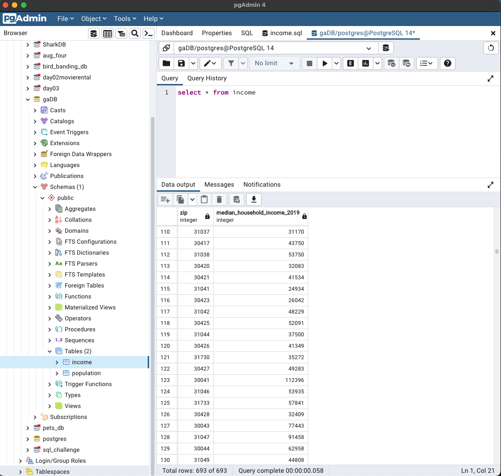

# ETL-GROUP3

Elite Transformers League, Unite!!

For this project, we were tasked with the challenge of extract, transforming and loading data. As a group, we decied that we would look at some of the housing demographics in the state of Georgia. We chose this data to assess the correlation between the average income and average hosuing costs across the state. We began with a csv file of zip codes that exist in GA. Our goal is was work with a this base zip code dataset and then extract different attributes/dimensions by zip codes, and then transform into JSON and load it into MongoDB.

Datasets Used: US Census Data and Atlanta Regional Commision
 - Dataset 01: https://gisdata.fultoncountyga.gov/search?tags=zip%20code
 - Dataset 02: https://data.neighborhoodnexus.org/
 

After we had decided on our datasets, we began working inside of Jupyter Notebooks to clean data by Panda & Python, as well as load dataset into Postgres. Then, extract all the data merge and loading it into MongoDB.

 
-001 
-002 
-003 

- 

- 

- 

